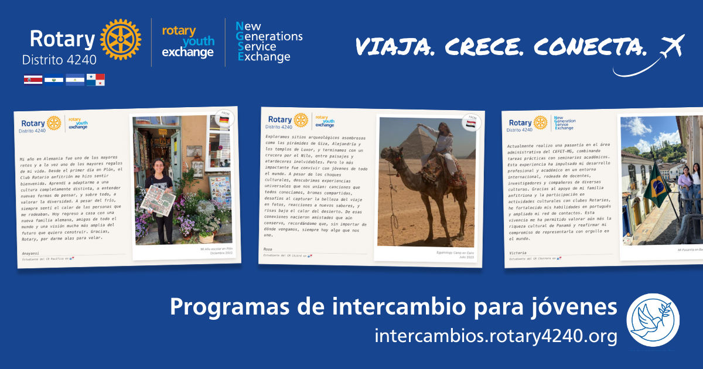

# Programa de intercambios juveniles de Rotary en Centroamérica (D4240) - Sitio oficial



Este proyecto es el sitio web oficial de los programas de intercambio del Distrito 4240 de Rotary International, que incluye Panamá, Costa Rica, El Salvador y Nicaragua. Está construido sobre la plantilla [Astro Sassify Template](https://github.com/larry-xue/astro-sassify-template), con personalización para reflejar los objetivos, secciones y formularios del programa.

El sitio ofrece información sobre intercambios largos, cortos, campamentos temáticos y pasantías internacionales, así como espacios para que rotarios, familias y profesionales se sumen como voluntarios.

> Este repositorio se mantiene público por si algún otro distrito rotario desea reutilizarlo o adaptarlo para sus propios programas.

---

## [Astro Sassify Template](https://github.com/larry-xue/astro-sassify-template)

A modern, responsive Astro template with Tailwind CSS and Alpine.js integration. This template provides a solid foundation for building fast, SEO-friendly websites with a clean design system.

## 🚀 Features

- [Astro](https://astro.build/) - The web framework for content-driven websites
- [Tailwind CSS](https://tailwindcss.com/) - Utility-first CSS framework
- [Alpine.js](https://alpinejs.dev/) - Lightweight JavaScript framework for interactivity
- Responsive design system with custom color palette
- Dark mode support
- Smooth page transitions
- Performance optimized
- SEO-friendly

## 📦 Project Structure

```text
/
├── public/             # Static assets
│   └── favicon.svg
├── src/
│   ├── assets/         # Images and other assets
│   ├── components/     # Reusable UI components
│   ├── layouts/        # Page layouts
│   ├── pages/          # Page routes
│   ├── scripts/        # JavaScript utilities
│   └── styles/         # Global styles
│       ├── global.css
│       └── transitions.css
├── astro.config.mjs    # Astro configuration
└── package.json        # Project dependencies
```

## 🧞 Commands

All commands are run from the root of the project, from a terminal:

| Command                   | Action                                           |
| :------------------------ | :----------------------------------------------- |
| `npm install`             | Installs dependencies                            |
| `npm run dev`             | Starts local dev server at `localhost:4321`      |
| `npm run build`           | Build your production site to `./dist/`          |
| `npm run preview`         | Preview your build locally, before deploying     |
| `npm run astro ...`       | Run CLI commands like `astro add`, `astro check` |
| `npm run astro -- --help` | Get help using the Astro CLI                     |

## 🎨 Customization

### Colors

The template defines its color palette using CSS custom properties in
`src/styles/global.css`:

- Primary: Purple-based color scheme
- Secondary: Slate-based color scheme
- Accent: Lime-based color scheme
- Warning: Yellow-based color scheme

Adjust these variables in `global.css` to change the look and feel.

### Typography

The template uses the following font families:

- Sans: Inter (with system fallbacks)
- Display: Lexend (with system fallbacks)

### Animations

Custom animations are included:
- Fade In
- Slide Up
- Slide Down

## 🚀 Getting Started

1. Clone this repository
2. Install dependencies with `npm install` or `pnpm install`
3. Start the development server with `npm run dev` or `pnpm dev`
4. Visit `http://localhost:4321` to see your site

## 📝 License

MIT

## 👀 Learn More

- [Astro Documentation](https://docs.astro.build)
- [Tailwind CSS Documentation](https://tailwindcss.com/docs)
- [Alpine.js Documentation](https://alpinejs.dev/start-here)
